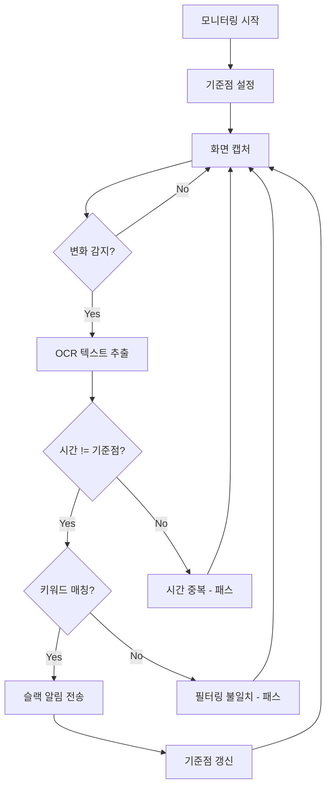

# 📧 Email Monitoring System

Python + Tesseract OCR을 활용한 실시간 메일 모니터링 및 슬랙 알림 시스템


## 🎯 프로젝트 개요

메일 시스템의 자동 알림 기능이 제한적인 환경에서 **화면 캡처 + OCR 기술**을 활용하여 실시간 메일 모니터링 및 슬랙 알림을 제공하는 프로그램입니다.

### 핵심 기능
- 📧 **실시간 메일 감지**: 화면 변화 기반 자동 감지
- 🔍 **키워드 필터링**: 특정 키워드 포함 메일만 알림
- 📢 **슬랙 연동**: 즉시 알림 전송
- 🎯 **중복 방지**: 시간 기반 중복 알림 차단
- 🔄 **자동 새로고침**: 세션 유지

## 🛠️ 기술 스택

- **Python 3.8+** - 메인 개발 언어
- **Tesseract OCR** - 이미지 텍스트 추출
- **OpenCV** - 이미지 처리 및 유사도 비교
- **tkinter** - GUI 인터페이스
- **PIL/Pillow** - 화면 캡처
- **Slack Webhook** - 알림 전송

## 📋 사전 요구사항

### 1. Python 환경
```bash
# Python 3.8 이상 필요
python --version
```

### 2. Tesseract OCR 설치

#### Windows
```bash
# 1. Tesseract 설치
# https://github.com/UB-Mannheim/tesseract/wiki 에서 설치 파일 다운로드
# 기본 경로: C:\Program Files\Tesseract-OCR\

# 2. 한글 언어팩 설치
# https://github.com/tesseract-ocr/tessdata/raw/main/kor.traineddata
# 다운로드 후 C:\Program Files\Tesseract-OCR\tessdata\ 폴더에 복사

# 3. 설치 확인
"C:\Program Files\Tesseract-OCR\tesseract.exe" --list-langs
# 출력에 'kor'가 포함되어야 함
```


## 🚀 설치 및 실행

### 1. 저장소 클론
```bash
git clone https://github.com/your-username/email-monitor.git
cd email-monitor
```

### 2. 의존성 설치
```bash
# 필수 패키지 설치
pip install -r requirements.txt
```

### 3. 실행 방법

#### 방법 1: 직접 실행
```bash
python main.py
```

#### 방법 2: 개발 모드 설치
```bash
# 개발 모드로 설치 (코드 수정 시 즉시 반영)
pip install -e .

# 어디서든 명령어로 실행 가능
email-monitor
```

#### 방법 3: EXE 빌드
```bash
# PyInstaller 설치
pip install pyinstaller

# EXE 파일 생성
pyinstaller --onefile --noconsole --name="메일모니터링" main.py

# dist 폴더에 실행 파일 생성됨
```

## 📖 사용 방법

### 1. 초기 설정
1. **영역 설정**: 제목 영역과 시간 영역을 드래그로 지정
2. **키워드 추가**: 모니터링할 키워드 입력
3. **슬랙 설정**: Webhook URL과 채널 설정

### 2. 슬랙 Webhook 설정
```bash
# 1. Slack에서 Incoming Webhook 생성
# https://api.slack.com/apps → Create New App → Incoming Webhooks

# 2. Webhook URL 복사
# https://hooks.slack.com/services/YOUR/WEBHOOK/URL

# 3. 프로그램에서 URL 입력 후 테스트
```

### 3. 모니터링 시작
```bash
1. 영역 설정 완료 확인
2. 키워드 등록 확인  
3. 슬랙 연동 테스트
4. "시작" 버튼 클릭
```

## 🔄 동작 흐름



## ⚙️ 설정 옵션

### 모니터링 설정
- **감지 주기**: 3~30초 (기본값: 5초)
- **유사도 임계값**: 0.8~1.0 (기본값: 0.95)
- **자동 새로고침**: 1~60분 간격 설정 가능

### 필터링 옵션
- **완전일치**: 정확한 키워드만 매칭
- **부분일치**: 키워드가 포함된 경우 매칭
- **대소문자 구분**: 대소문자 구분 여부

## 🗂️ 프로젝트 구조

```
email-monitor/
├── main.py                    # 진입점
├── requirements.txt           # 의존성 목록
├── setup.py                  # 패키지 설정
└── src/
    ├── models/               # 데이터 모델
    ├── core/                 # 핵심 로직 (OCR, 모니터링)
    ├── services/             # 외부 서비스 (슬랙)
    ├── ui/                   # UI 컴포넌트
    └── utils/                # 유틸리티
```
